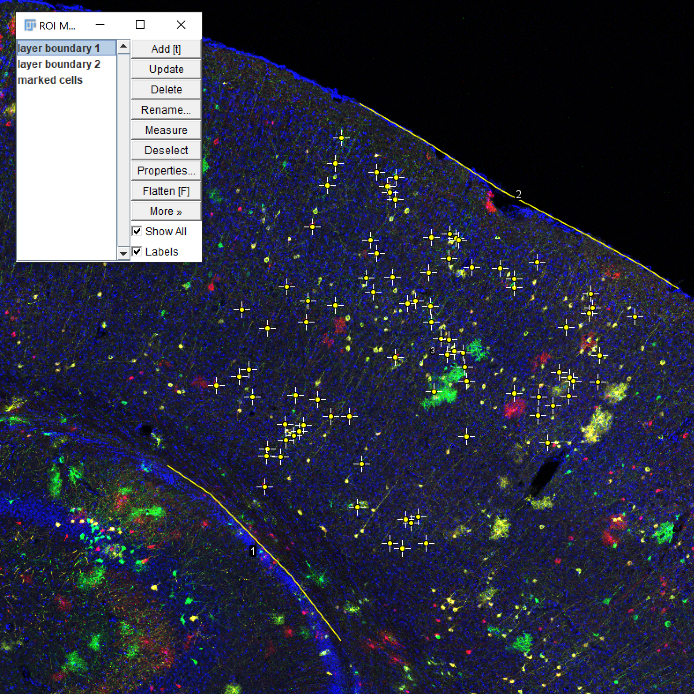
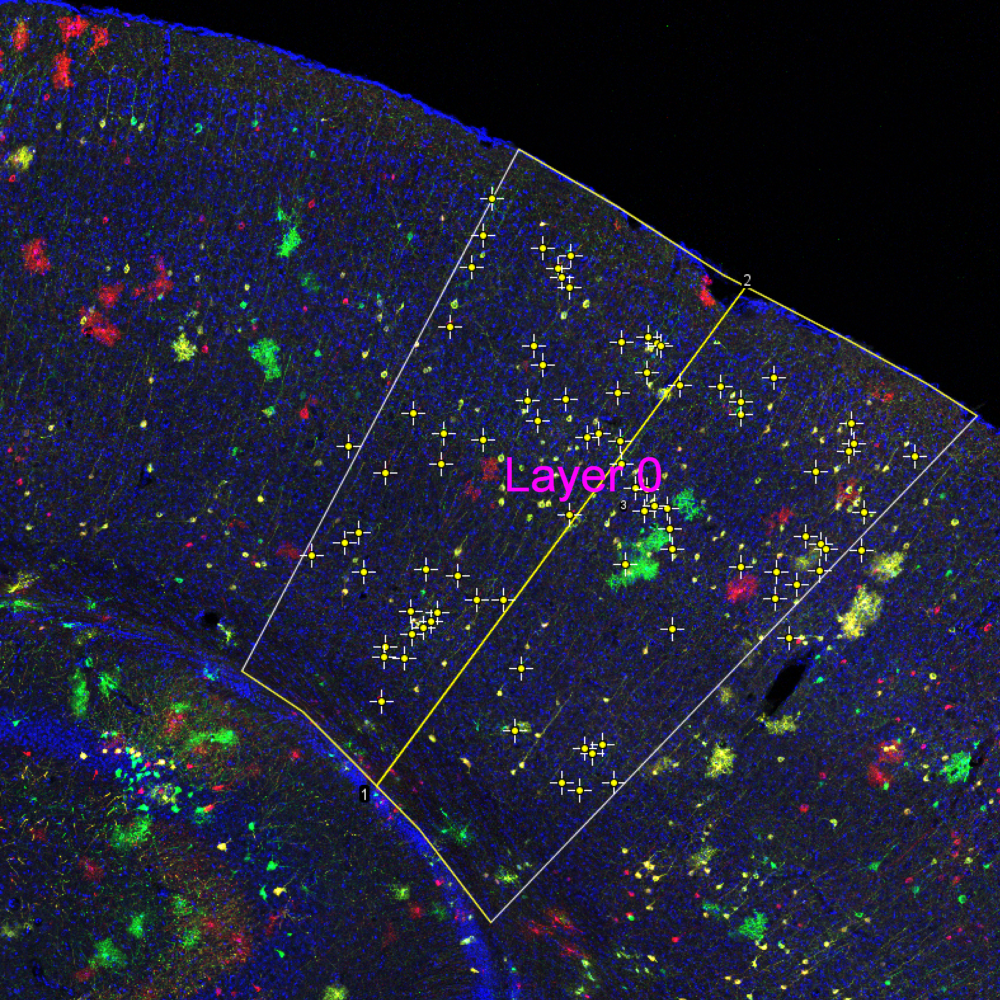
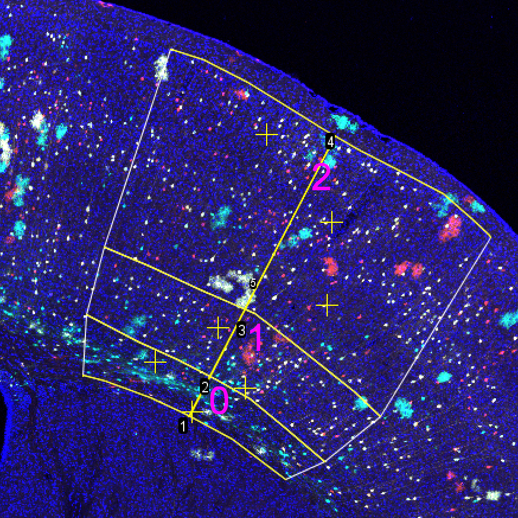
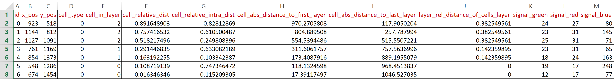

# cell2layer
---
Cell2layer quantifies relative and absolute positions of manually marked cells within
manually defined cell layers.
Please refer to: https://doi.org/10.1093/oons/kvac009

### Input
First, cell layers are defined by `Segmented Line` ROIS in
ImageJ and added to the `ROI Manager`. Each layer ROI marks the boundary of the
subsequent layers. Then, points (usually cell positions) are marked with ImageJ's `Point` ROI, and are also added to the manager. The naming of the ROIs can be arbritary, but layer boundariy ROIs need to be added in sequential order.

    

Note, in the example only one layer, hence two layer boundaries are chosen.

### Output
Executing the `cell2layer.py` Fiji (jython) script, will assign each marked point to
the layer (marked in magenta) where it is placed in. If only one layer is defined, marked cells are assigned to layer 0. Cells marked outside of the layer boundaries marked as such in the output.

    

The script computes the relative and absolute positions of each marked point regarding the first and last layer boundaries, as well as, its relative position within its assigned layer. For each marked point the *shortest distance* to the first (`cell_abs_distance_to_first_layer`) and last layer (`cell_abs_distance_to_last_layer`) boundary is computed (in pixel), resulting in two distances *d*1 and *d*2. From this, the relative distance (`cell_relative_dist`) of the point is derived, where the first layer boundary is defined as 0 and the last as 1.

*rd*1 = *d*1 / (*d*1 + *d*2)

### More layers

If more layer boundaries are provided, the relative position of a marked point within its assinged layer, the same computation is applied for the layer boundaries of the layer, where the point was assined to. (`cell_relative_intra_dist`).

    

Furthermore, the relative size of each layer is approximated as ratios of the layer sizes according to the perpendicular central axis connecting the the centers of each layer boundary (`layer_rel_distance_of_cells_layer`). Additonally, the signal intensity of each input channel of the image is extracted and added to the output table. If the points marked with as different types the column `cell_type` will contain the type of the marked point.

## Result
The following tab separated table is written as output.

    

<!---
The script computes the relative and absolute distances of each marked cells to its layer boundaries. Layer boundaries are manually provided as segmented lines. For each cell the shortest distance to the layer boundaries resulting in two distances *d*1 and *d*2. The normalized (relative) distance is computed by

*rd*1 = *d*1 / (*d*1 + *d*2)

-->
